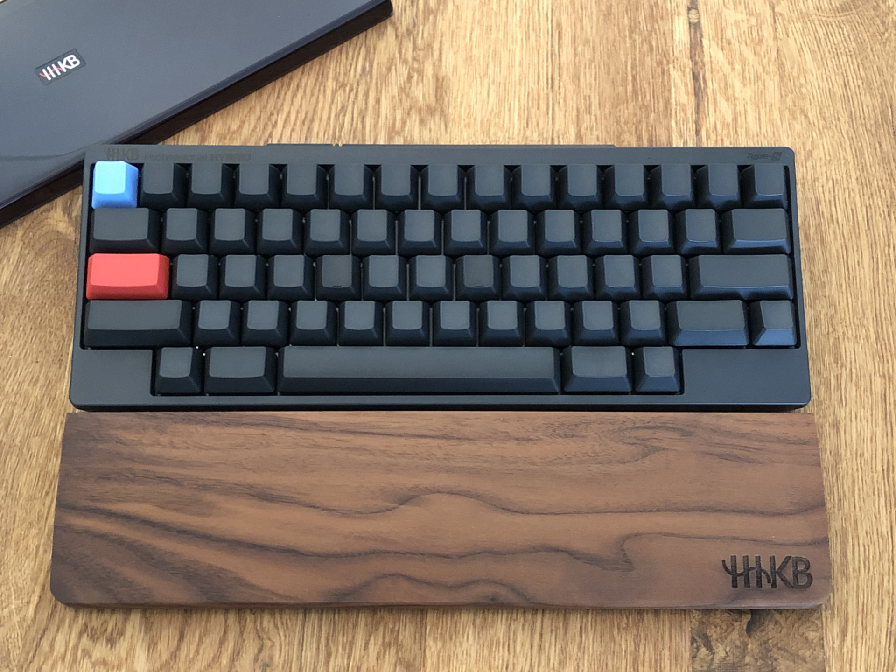
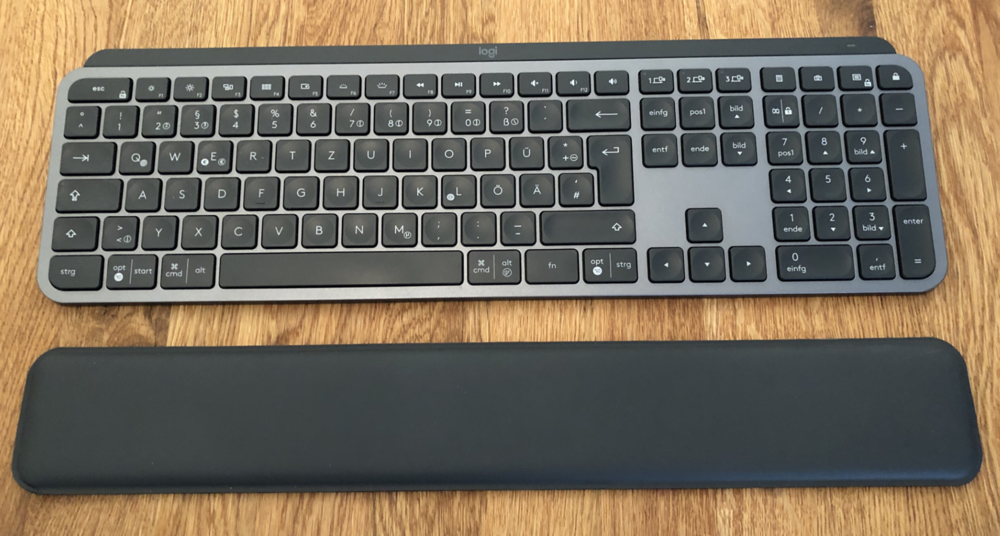
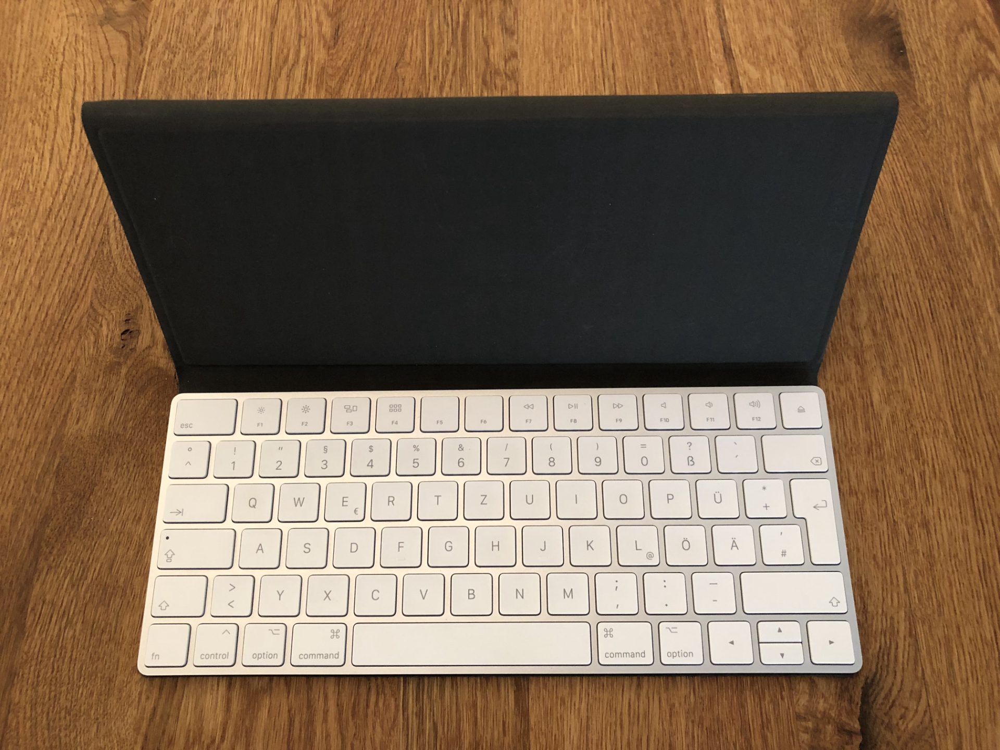
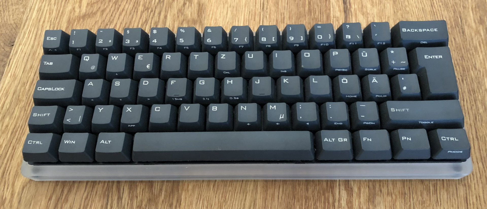
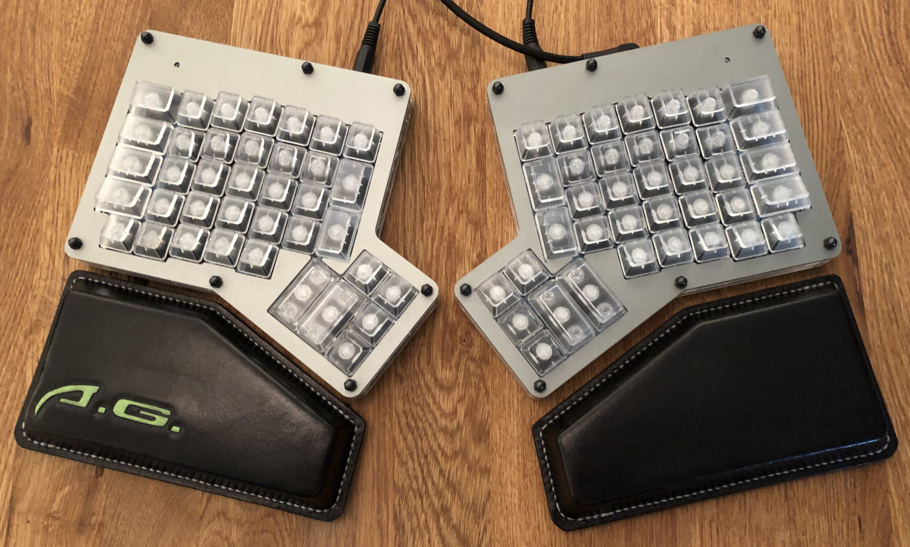

I type ~40-70h on different Keyboards every week and in the last years I had used over 25 different ones. I also assembled my own Keyboards. In this post I want to share my favorits for each situation and some tipps.

## My Keyboard recommendations

### 1. _„HomeOffice“:_

**[Filco Majestouch Convertible 2 TKL](https://www.diatec.co.jp/en/list.php?s[]=100:1001:0&s[]=120:1014:0)** + **[Majestouch TenKeyPad 2 Professional](https://www.diatec.co.jp/en/det.php?prod_c=3240)** + Palm-Rest

> ➕ Design (build quality, default TKL, timeless, matching numpad)  
> ➕ Batteries last like forever  
> ➖ Mini USB  

=> Best mechanical TKL/80% (ISO-DE) + Numpad Combo

(* MacOS compatibility - Use [Karabiner-Elements](https://karabiner-elements.pqrs.org) to [fix layout](https://ke-complex-modifications.pqrs.org/#german_pc_shortcuts) issues or improve it.)

### 2. _„Special Motivation“ :_

[**HHKB Professional Hybrid Type-S**](https://happyhackingkb.com/jp/products/hybrid_types/) (non-printed key-caps) + Palm-Rest

> ➕ Custom key-mapping/Layer + non-print Keycaps (also for compatibility with different languages or layouts)  
> ➖ Missing keys - available on the second virtual layer  
> ➖ Availability - until today you can only import it from Japan  
> ⚠️ Perfect for advanced typists which like [VIM](https://neovim.io) 😜

=> Best 60% layout - enjoy typing and dream of beeing a happy hacker

### 3. _„Office“ :_

**[Logitech MX Keys](https://www.logitech.com/en-gb/product/mx-keys-wireless-keyboard)** + Palm-Rest

> ➕ Hetrogenic OS support + wireless UEFI/BIOS capable dongles  
> ➕ Well made rubber-dome keys with backlit  
> ➖ Some strange Mappings & Prints ( Key after F12, €E€ [ISO/DE]..)  
> ➖ Batteries not changeable

=> Best silent Keyboard for the open-plan office - like a swiss army knife for every kind of tasks

### 4. _„Share/Spare/Couch“ :_

**[Logitech K380](https://www.logitech.com/en-gb/product/multi-device-keyboard-k380)** -

> ➖ A timeless design would be better  
> ➖ Batteries not changeable

=> Best universal mobile solution

### 5. _„Mobile“ :_

**[Apple Magic Keyboard](https://www.apple.com/shop/product/MLA22LL/A/magic-keyboard-us-english)** + **[Studio Neat Canopy](https://www.studioneat.com/products/canopy)**

> ➕ Native Mac Layout  
> ➖ Batteries not changeable  
> ➖ Should be USB-C instead of lightning

=> Best mobile solution for everything with a Apple on it

### 6. _„Game/Fun“ :_

**[Vortex Poker II](http://www.vortexgear.tw/vortex2_3.asp?kind=47&kind2=220&sn=6&so6=open)** + PBT Keycaps

> ➕ 3. programmable custom Layer  
> ➖ Mini USB

=> Good quality/price ratio (Version III available)

### 7. _„Special-Project-X“ :_

[**ErgoDox**](https://www.ergodox.io) with DSA Keys

> ➕ Palm-Rest + Ergonomic Design  
> ➕ Custom Key-mapping and 9-Layer  
> ➖ Many Cables / Mini-USB / Jack-Connectors

=> Build from PCB to Software like you want.

### Mechanical Keyboard I would like to test

- [REALFORCE R2 PFU Limited Edition Silent TKL](https://www.realforcekeyboards.com)
- [Caps-Unlocked CU80](https://caps-unlocked.com/group-buy-cu80-round-2/)
- [Code V3 TKL](https://codekeyboards.com) (WASD Keyboards)
- [Keystone Analog Tactile Mechanical Keyboard](https://kono.store/products/keystone-analog-mechanical-keyboard)
- [Ultimate Hacking Keyboard](https://ultimatehackingkeyboard.com)

## Palm rest

I can highly recommend to use a matching hight palm rest for adjusting the angle of your wrist to every keyboard.

## Spring vs Rubber

If you really need or like to be silent - or you like a really short/soft key-travel - go for Rubber, otherwise I would always recommend [mechanical Spring based Key-Switches](https://www.mechanicalkeyboards.com/switches/). With [Cherry MX-Brown](https://www.cherrymx.de/mx-original/mx-brown.html) or equivalent like, you will never make a bad choice - it could make sense to [test all of them](https://de.aliexpress.com/wholesale?SearchText=key+switch+tester) if you want to build your own keyboard with a diy-kit. If you want to go crazy you can also fine tune all of those MX style switches with lube, custom springs or o-rings.
My favorits are the [Topre](https://www.keychatter.com/topre-switches/) 45g switches in terms of sound and their nice smooth and balanced key-travel, but they are only available in a few expensive Keyboards. The worst choice in my opinion is a rubber key-switch with long key-travel - makes no sense to me.

## Layouts

There are those three major base key layouts ANSI, ISO and JIS - But there are still more around like KS, ABTN and others.
Which layout you should choose depends on your language and your tasks. It could make sense to go for a ANSI/US layout if you are a german software developer like me. But then you have trouble to map those needed german letters like ü, ö and ä in a quickly reachable way. If you use a JIS key layout you would have up to 109 base Keys (+ additional ones like F1-Fx, arrow keys, numpad, etc.) - so with a bit of work you will get every visual language layout mapped.
Regarding the visual layout there are a lot of different language specific "default" printigs available. It's a good decision to use a keyboard with switchable key-caps (like cherry mx, Alps or Topre ) standard to be able to change the visual layout in terms of color, printing, [profile](https://thekeeblog.com/overview-of-different-keycap-profiles/) and [material/texture](https://mechanicalkeyboardinfo.com/abs-vs-pbt-vs-pom-keycap-plastic/). On my HHKB keyboard I liked to have a DCS profile, PBT sandy grip and no printings at all to don't get in any conflict between the visual and mechanical layout.

But then we get to the functional layout witch depends on the operating system and language default, but could be customised. There are a lot of alternative layouts like [Dvorak](https://www.dvzine.org), [Colmark](http://colemak.com/), or [Neo2](https://neo-layout.org). You can find a list of alternative en/de layouts [here](https://git.neo-layout.org/neo/neo-layout/wiki/Verweise%20auf%20andere%20Projekte).

If you want to customise or create your own functional layout you could do this with a customizable firmware like [QMK](https://qmk.fm) ([Editor](https://config.qmk.fm/)) or with drivers and software like [Karabiner-Elements](https://karabiner-elements.pqrs.org).

And if this isn't still not enough you can also tweak all this by adding additional virtual layers to your layout, that could have also programable macros mapped to some keys.

## Upcoming evolutions

- [Low profile mechanical switches](https://www.kailhswitch.com/mechanical-keyboard-switches/low-profile-key-switches/) like the [FILCO Majestouch Stingray](https://www.diatec.co.jp/en/Stingray/)
- [Beam-Spring](https://www.youtube.com/watch?v=gFYoh5VcZvg) with [Hall-Effect](https://en.wikipedia.org/wiki/File:Hall_Sensor.webm) sense Key-Switches like the upcomming [Silo Beam](https://kono.store/blogs/keyboards/silo-beam) („AI“ typing correction, gas pedal like key press levels)

## Recommendations

### Take care of your Keyboard

Don’t eat & type and wash your hands.
Clean your Keyboard at least every 40h of usage or more often - I use a vacuum cleaner and a microfibre cloth with 70% isopropyl alcohol on it.
Use a cloth or a cover to protect your keyboard from dust. In terms of mechanical keyboards, you can also disassemble the keys to clean everything if needed.

### Buy the right one or build it

Buy a Keyboard that match the most of your requirements. Buy no garbage and with a plan to use it long term. Don’t buy more Keyboards as devices you own. Don't buy a ANSI layout version only because of a not available ISO version (or vice versa) if you don't want to switch the layout your muscle memory is trained to.
And if nothing helps, you can buy all needed parts and assemble your own one. Take a look on e.g. [GH80 at GeekHack](https://geekhack.org) for a first start - it's easier than it's sounds.
