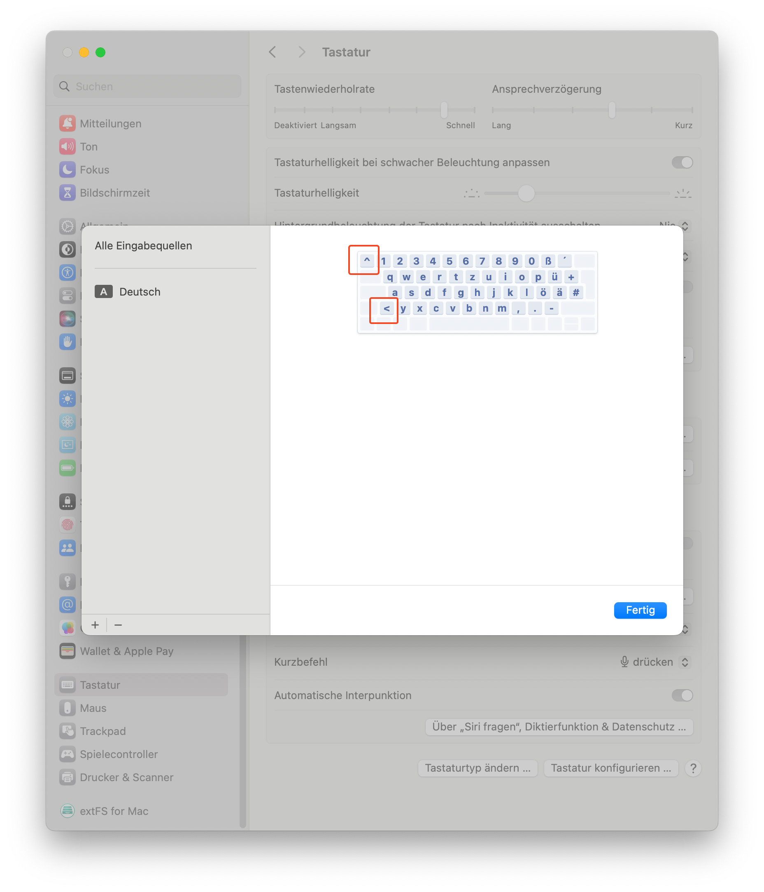

---
slug:'MacKeyboardTypeFix'
title: 'macOS - External Keyboard keys are swapped (solved)'
subtitle: 'Sometimes macOS could be painful..'
image: 'KeyboardTypeError.png'
imageTitle: 'macOS keyboard type fix'
imageAlt: 'macOS keyboard type detection Fix'
repo: ''
liveLink: ''
date: '2023-12-30T00:00:00-07:00'
tags:
  - Keyboard
type: 'blogPost'
---

## Issue

### My case:

`<` and `^` keys are swapped
- `<` Key (right of SHIFT)
- `^` Key (left of 1)

This is because macOS set the wrong keyboard type (ISO, ANSI, JIS, ..) even if the wizzard shows the right result.

### On QMK based keyboards:

- KC_NUBS
	- ISO:  `< >`
	- ANSI: Non-US `\` and `|`
- KC_GRV
	- ISO: `^ °`
	- ANSI: `~ ´`

### macOS default settings

	System Settings --> Keyboard --> Change Keyboard Type --> go through the Wizzard --> Done.

But for me and a lot of others with external keyboards not from Apple this won't work. In the past I fixed this issue with [Karabiner-Elements](https://karabiner-elements.pqrs.org) , but this is more like a [workaround](https://apple.stackexchange.com/questions/227294/change-mac-keyboard-identifier-after-keyboard-replacement) as a proper fix. A further option would be to remap the keyboard key's on QMK or VIA Keyboards, but this is crazy and won't work in combination with other operating systems. 

## Easy Fix

Enforce macOS to indentify the keyboard type without any previous knowledge:

1. `sudo rm /Library/Preferences/com.apple.keyboardtype.plist`
2. Remove both keyboard and mouse from the USB ports on the monitor/USB hub.
3. Reboot

## If still not working

1. `sudo plutil -convert xml1 /Library/Preferences/com.apple.keyboardtype.plist`
2. text edit e.g. `sudo nvim /Library/Preferences/com.apple.keyboardtype.plist`
	1. change type 43 to 41 (or 43 if there is already a 41 - but change back after reboot.)
	2. change all - may after restart new ones getting in
3. `sudo plutil -convert binary1 /Library/Preferences/com.apple.keyboardtype.plist` (Converting back to binary is optional - reboot will also fix this.)
4. Reboot - with unplugged keyboard.
5. Repeat until the macOS keyboard detection tool doesn't detect new keyboards after login - .plist get's extended each time.

In my case this was the result after a few restarts and changes:
```xml
<?xml version="1.0" encoding="UTF-8"?>
<!DOCTYPE plist PUBLIC "-//Apple//DTD PLIST 1.0//EN" "http://www.apple.com/DTDs/PropertyList-1.0.dtd">
<plist version="1.0">
<dict>
	<key>keyboardtype</key>
	<dict>
		<key>1031-4176-0</key>
		<integer>41</integer>
		<key>5-41219-0</key>
		<integer>41</integer>
		<key>50504-1133-0</key>
		<integer>41</integer>
		<key>6-41219-0</key>
		<integer>41</integer>
	</dict>
</dict>
</plist>
```

This should be the result:


## Credits

- Thx to: https://apple.stackexchange.com/questions/239395/and-keys-are-swapped
- [QMK Firmware](https://qmk.fm)
	- [QMK Keycodes](https://docusaurus.qmk.fm/keycodes/)
	- [QMK Default Keymaps](https://docusaurus.qmk.fm/faq_keymap)
- [VIA Firmware](https://www.caniusevia.com)
