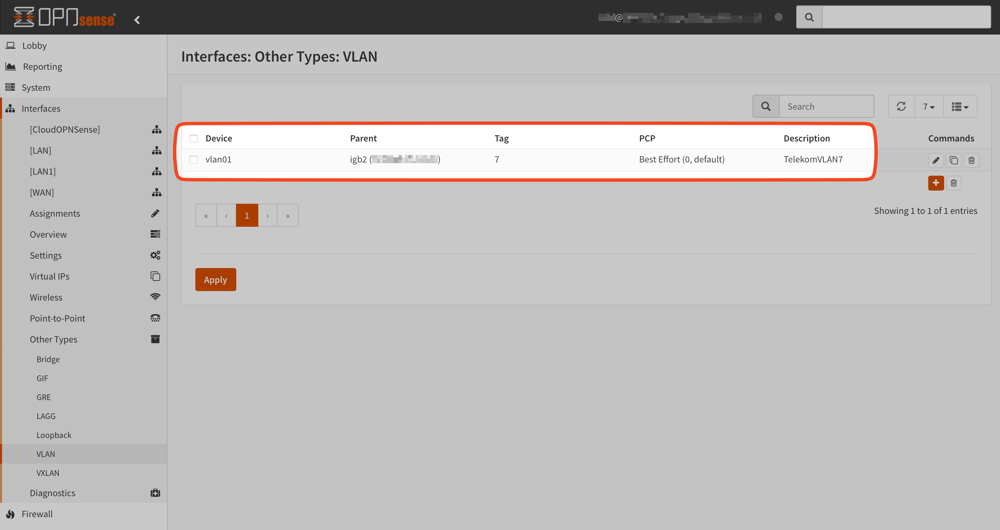
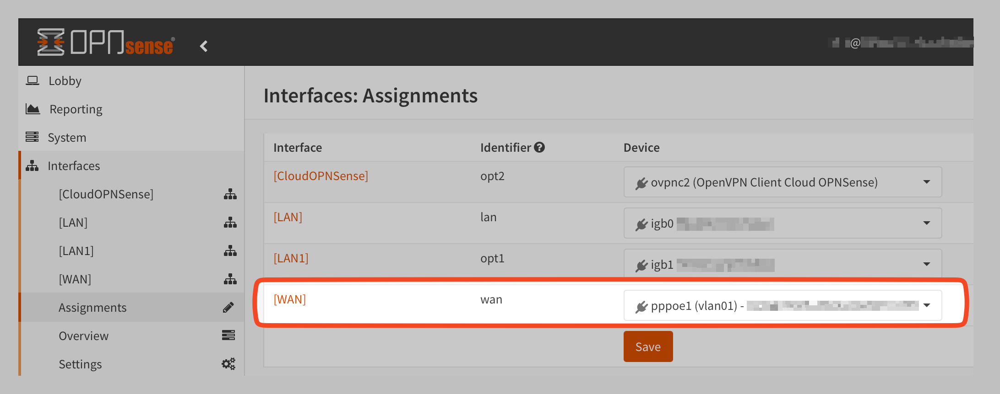
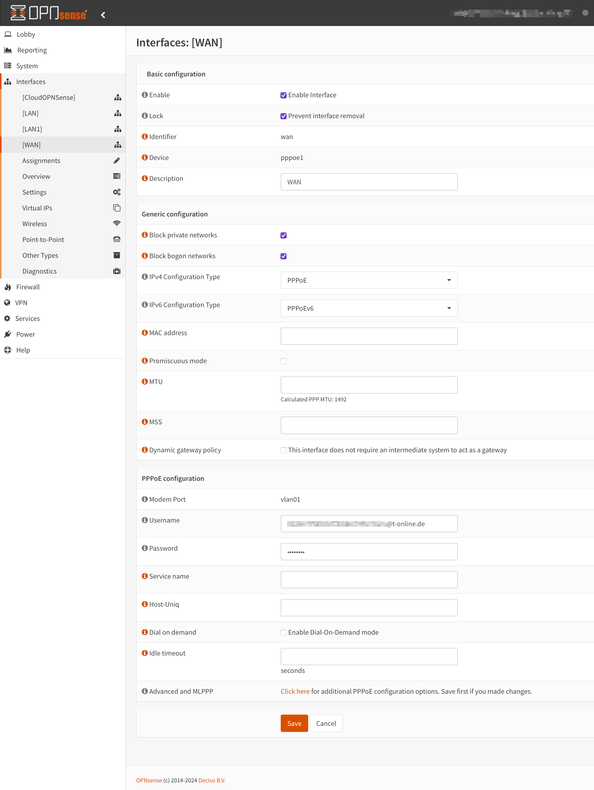

In Germany, fast and high-quality internet is still rare due to lacking infrastructure. As a private customer, it's challenging to get a full internet connection with fixed IPv4 and IPv6 addresses, as well as reverse DNS PTR records. While only a few providers like Vodafone offer such things, other providers require more complicated solutions to do so. Unfortunately, Telekom, a provider of fiber optic connections in Germany, does not offer these options for private customers.

To bypass restrictions, it's advisable to use your own hardware. A VPN with a fixed IP endpoint and reply-to gateway configurations can be helpful. Although Telekom offers a solid modem with the 'Glasfaser-Modem 2,' which in my case allows the use of custom hardware, but my goal was maximum control over the hardware I operate.

# Hardware

A separate modem is recommended for an advanced setup.

## Fiber Optic Modem - Telekom Standard

- Modem: [Telekom Glasfaser-Modem 2](https://www.telekom.de/zuhause/geraete-und-zubehoer/wlan-und-router/glasfaser-modem-2)
- SFP Module: [Digitalisierungsbox Glasfasermodem](https://geschaeftskunden.telekom.de/internet-dsl/produkt/digitalisierungsbox-glasfasermodem-mieten)

## Alternatives

Various options are available, including the following that I found suitable for me.

### Firewall
- OPNSense Deciso Hardware e.g., Dec740: [OPNSense Desktop Security Appliance](https://shop.opnsense.com/product/dec740-opnsense-desktop-security-appliance/)

### Firewall + Accesspoint

- Banana-PI BPI-R3 or R4: [Banana Pi BPI-R3](https://wiki.banana-pi.org/Banana_Pi_BPI-R3)
  - I use it just as a dedicated access point with Open-WRT, but could also act as firewall.

### GPON ONU ONT Fiber Module

- GPON SFP Transceiver Module with DDM - GPON SFP ONU Stick with Mac: [FS.com GPON SFP ONU Stick](https://www.fs.com/de/products/133619.html)
	- Customized versions available as 1:1 clone of existing hardware with brand, MAC address, serial number, and device number pre-programmed
	- It is a nice module that is suitable for many modifications - [Doku](https://hack-gpon.org/ont-fs-com-gpon-onu-stick-with-mac/)
- More alternatives and documentation: [Hack GPON](https://hack-gpon.org)

As the GPON module has a temperature range of -40 °C to 85 °C and gets and stays hot during operation, I recommend a separate housing, e.g. "TP-Link Gigabit SFP Media Converter MC220L".
Despite the temperatures, the passive cooling is sufficient in my case even in a closed multimedia distribution box inside of a wall.

### GPON Configuration

To configure the GPON module, connect via SSH with a manual IP address in the same subnet. (The module does not require connected fiber.)

```sh
ssh ONTUSER@192.168.1.10 -oKexAlgorithms=diffie-hellman-group14-sha1 -oHostKeyAlgorithms=ssh-rsa
```
The default password is `7sp!lwUBz1`.
### Configuration Steps
#### 1. PLOAM Password

- FTTH 1.7
	- Ask the technical hotline
	- `sfp_i2c -i11 -s "1234567890"`
- FTTH 2.0 - new "GigabitGeschäftsbereich"
	- No password is required
	- `sfp_i2c -i11 -s ""`

#### 2. Set Serialnumber

The serial number here `ABCD12345678` can be a fictitious one or correspond to a previous module and must be communicated to the technical service together with the fiber optic ID if changed or new:

`sfp_i2c -i 8 -s "ABCD12345678“`
`uci set sfp_eeprom.default.serial_no=ABCD12345678`
`uci commit`

#### Create full clone

I have not tested this example
```sh
set_serial_number HWTC956EABBA
uci set network.host.macaddr=98:3F:60:00:AB:BA 
uci commit network.host.macaddr=98:3F:60:00:AB:BA 
sfp_i2c -i 0 -s "HUWAWEI" 
sfp_i2c -i 1 -s "HG8010Hv6" 
sfp_i2c -i 2 -s "0001" 
sfp_i2c -i 3 -s "48575443956EABBA" 
sfp_i2c -i 7 -s "HWTC"
fw_setenv sgmii_mode
uci commit 
reboot

```

### Firewall / Router Config

V-LAN and PPPoE configuration is required.
- VLAN = 7 
- QoS = 0





Username / PPPoE: "Anschlusskennung"+"Zugangsnummer"+“0001"+"@t-online.de"
Password: `12345678` - yes really, this value is OK

The information can be taken from the letter with the access data from Telekom.



---

## Useful information for Telekom customers

### Transitional solution for new fiber optic connections

Telekom offers a transitional solution "Sofort-LTE" for completely new fiber optic connections via the owner management "Bauherrenservice". This is a relatively solid LTE-based Internet access with 30 to 10 mbit.

### Telekom hotlines

#### Phone numbers

- Technology: 08003301000
- Owner management: 08003304174
- Owner service: +498003301903 / +4908002266100 / +498007733888
  
#### Information on authentication

- Order number (*POM* = new connection / PSM = existing connection)
- Customer number
- Own landline telephone number from Telekom
- IBAN last 6 digits
- Address
