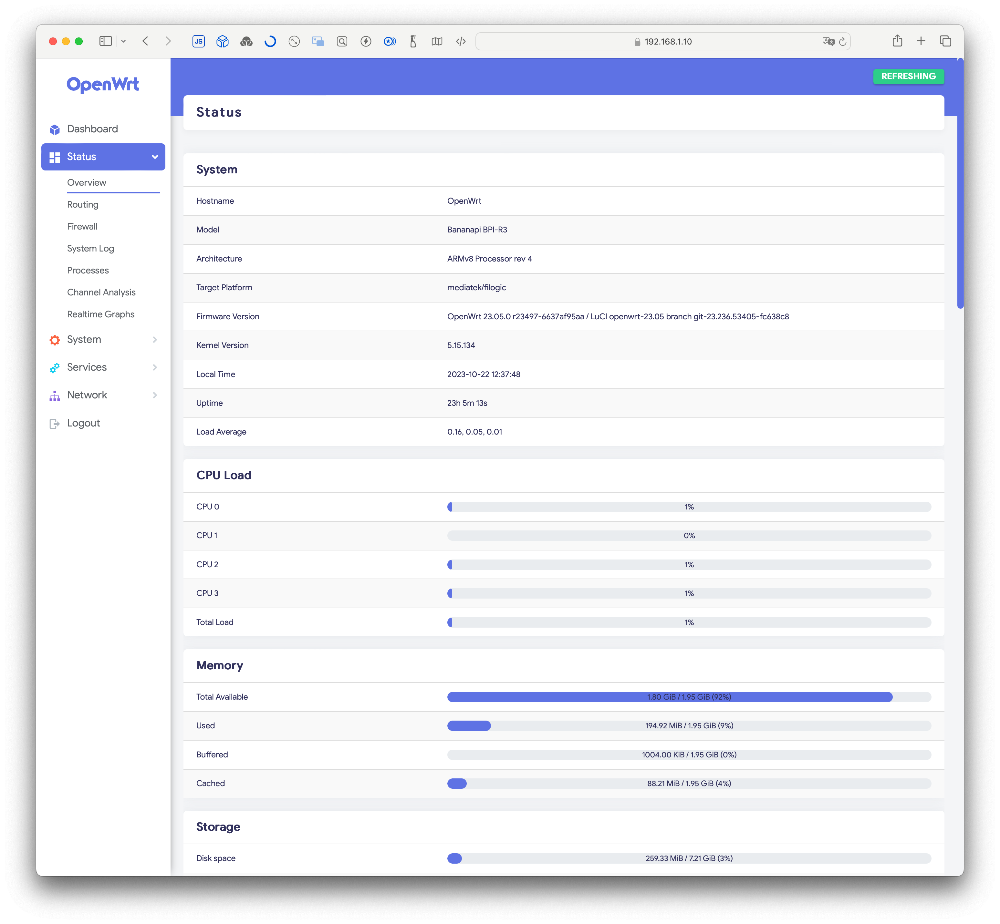

I have used DD-WRT in the past with Linksys devices and found it very good.
So far I have used a Synology router as an access point - but I thought the next wifi solution should be based on open source software.
This idea was mainly inspired by the positive experience of using OPNSense with Dec740 as the main router&firewall - I love this device. 
That's how I came up with the OSS Wifi counterpart [OpenWrt](https://openwrt.org).

## Banana Pi R3

Clearly one of the best Wifi OpenWrt solutions on the market is the self-build solution with a [Banana Pi R3](https://wiki.banana-pi.org/Banana_Pi_BPI-R3) Board. This is available in complete sets on Aliexpress with great metal enclosures, antennas and everything required (may only a optional TTL USB adapter is missing).

The Wifi power of this devices covers even professional requirements with 4x4 5ghz and 2.4ghz.
A powerful ARM CPU, 2GB RAM, 8GB MMC storage and 2SFP slots give a lot of room for a wide range of use-cases.


If you want to wait [Banana Pi R4](https://wiki.banana-pi.org/Banana_Pi_BPI-R4) is also getting around next year - Wifi-7, 4GB RAM, 10Gbit SFP+, USB Power.

## Set-UP

Here you can find working set-up notes collected from tutorial sources linked below - with those I got a good base installation on the BPI-R3. 

Best tutorials are those:
- https://wiki.banana-pi.org/Getting_Started_with_BPI-R3
- https://openwrt.org/toh/sinovoip/bananapi_bpi_r3_v1.0_v1.1

OpenWrt is available as a stable version [23.05 at the moment of writing](https://firmware-selector.openwrt.org/?version=23.05.0&target=mediatek%2Ffilogic&id=bananapi_bpi-r3) which was used for this.

1. Unzip bananapi_bpi-r3-sdcard and write the image on a micro sd card using:
	- on linux: `dd if=openwrt-mediatek-filogic-bananapi_bpi-r3-sdcard.img of=/dev/( mmcblk_ OR sd_ )`
	- on win: https://sourceforge.net/projects/win32diskimager/
	- on macOS: https://etcher.balena.io
2. Insert the SD card into the bpi-r3
3. To install on NOR (32 MB) (optional):
	1. Set the boot switch as 1101 (up,up,down,up)
	2. Connect power cord and wait boot (~20s)
	3. ssh the device and type:
		 `fw_setenv bootcmd "run nor_init ; env default bootcmd ; saveenv ; reset"; reboot`
	4. Wait reboot and nor flashing (~90s)
	5. Disconnect power
4. To install on NAND (128 MB) (optional):
	1. Set the boot switch as 1111 (up,up,up,up)
	2. Connect power cord and wait boot (~20s)
	3. ssh the device and type:
		   `fw_setenv bootcmd "run ubi_init ; env default bootcmd ; saveenv ; reset"; reboot`
	4. Wait reboot and NAND flashing (~90s)
	5. Disconnect power
5. To install on eMMC (8192 MB) (optional):
	1. Set the boot switch as 1010 (up,down,up,down)
	2. Connect power cord and wait boot (~20s)
	3. ssh the device and type:
		 `fw_setenv bootcmd "run emmc_init ; env default bootcmd ; saveenv ; reset"; reboot`
	4. Wait reboot and eMMC flashing (~90s)
	5. Disconnect power
	6. Set the boot switch to your favorite location

The images relies on [F2FS](https://docs.kernel.org/filesystems/f2fs.html) filesystem.

To create data partition and resize eMMC f2fs, boot on NOR(0000) or NAND(1010) and type (internet connection required):

```sh
opkg install cfdisk parted
parted /dev/mmcblk0 -- mkpart f2fs 768MiB -34s resizepart 5 768MiB resizepart 4 67.1M resizepart 3 12.6M 
  # say F to fix gpt global size
reboot

## optional increase the size of the partition /dev/mmcblk0p5 to the max by deleting /dev/mmcblk0p6 partition and resize with:
cfdisk /dev/mmcblk0

## resize filesystem after:
mount /dev/mmcblk0p66 /mnt && umount /dev/mmcblk0p66 && resize.f2fs /dev/mmcblk0p66

## Boot to MMC storage
```

Now boot on eMMC(0110) and check if it worked !

Background: /dev/mmcblk0p66 is inside of /dev/mmcblk0p5.

### OpenWrt The Argon Theme

The [Argon theme](https://github.com/jerrykuku/luci-theme-argon) is the most beautiful looking one available atm of writing.



For OpenWrt 23.05 you can just install it with those commands:

```sh
opkg install luci-compat
opkg install luci-lib-ipkg
wget --no-check-certificate https://github.com/jerrykuku/luci-theme-argon/releases/download/v2.3.1/luci-theme-argon_2.3.1_all.ipk -O luci-theme-argon_2.3.1_all.ipk
opkg install luci-theme-argon*.ipk
```

Install the theme config menu `luci-app-argon-config` to be able to configure the Theme from OpenWrt Luci web UI:

```sh
wget --no-check-certificate https://github.com/jerrykuku/luci-app-argon-config/releases/download/v0.9/luci-app-argon-config_0.9_all.ipk -O luci-app-argon-config_0.9_all.ipk
opkg install luci-app-argon-config*.ipk
```

## Cooling & FAN

Hint to get it working:

`echo 70000 > trip_point_2_temp`

[OpenWrt GitHub Issue - PWM Fan](https://github.com/openwrt/openwrt/issues/13772)

## CPU and Temp Extension

[luci-app-cpu-status-mini](https://github.com/gSpotx2f/luci-app-cpu-status-mini)

```sh
wget --no-check-certificate -O /tmp/luci-app-cpu-status-mini_0.1-5_all.ipk https://github.com/gSpotx2f/packages-openwrt/raw/master/current/luci-app-cpu-status-mini_0.1-5_all.ipk
opkg install /tmp/luci-app-cpu-status-mini_0.1-5_all.ipk
rm /tmp/luci-app-cpu-status-mini_0.1-5_all.ipk
/etc/init.d/rpcd reload
```

[luci-app-temp-status](https://github.com/gSpotx2f/luci-app-temp-status)

```sh
wget --no-check-certificate -O /tmp/luci-app-temp-status_0.3-5_all.ipk https://github.com/gSpotx2f/packages-openwrt/raw/master/current/luci-app-temp-status_0.3-5_all.ipk
opkg install /tmp/luci-app-temp-status_0.3-5_all.ipk
rm /tmp/luci-app-temp-status_0.3-5_all.ipk
/etc/init.d/rpcd reload
```

## Custom Build

[OpenWrt Firmware-Selector - BananaPiR3](https://firmware-selector.openwrt.org/?version=23.05.2&target=mediatek%2Ffilogic&id=bananapi_bpi-r3)

```
base-files busybox ca-bundle dnsmasq dropbear e2fsprogs f2fsck firewall4 fstools kmod-crypto-hw-safexcel kmod-gpio-button-hotplug kmod-hwmon-pwmfan kmod-i2c-gpio kmod-leds-gpio kmod-mt7915e kmod-mt7986-firmware kmod-nft-offload kmod-sfp kmod-usb3 libc libgcc libustream-mbedtls logd luci mkf2fs mt7986-wo-firmware mtd netifd nftables odhcp6c odhcpd-ipv6only opkg ppp ppp-mod-pppoe procd procd-seccomp procd-ujail uboot-envtools uci uclient-fetch urandom-seed urngd terminfo cfdisk resize2fs parted losetup fdisk block-mount luci-lib-ipkg luci-compat curl luci-theme-openwrt-2020 libopenssl3 ttyd luci-app-ttyd dbus samba4-server luci-app-samba4 luci-app-commands hostapd-utils btop luci-mod-dashboard wifischedule luci-app-wifischedule luci-app-ntpc zsh bottom wpad-mbedtls
```

`wpad-mbedtls` enables WPS features

Pagage `luci-app-commands` helps to start WPS with added command `hostapd_cli wps_pbc` in UI --> makes it available in UI

### Optionals

`luci-app-sqm` for traffic shaping and limitations.
